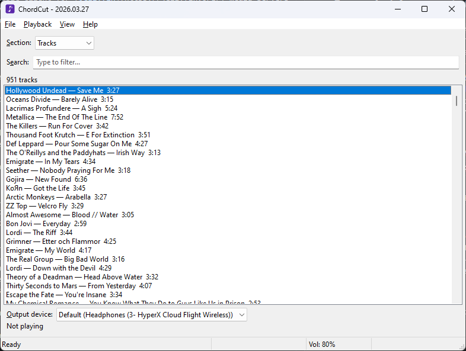
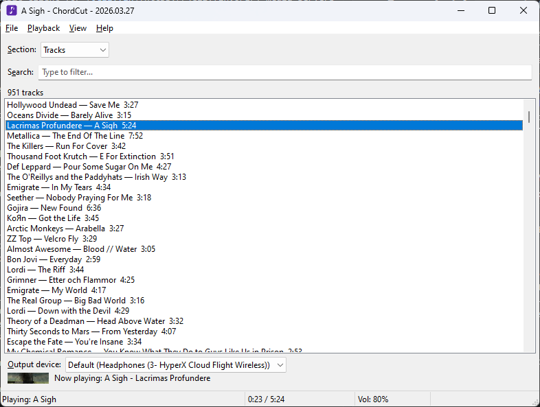
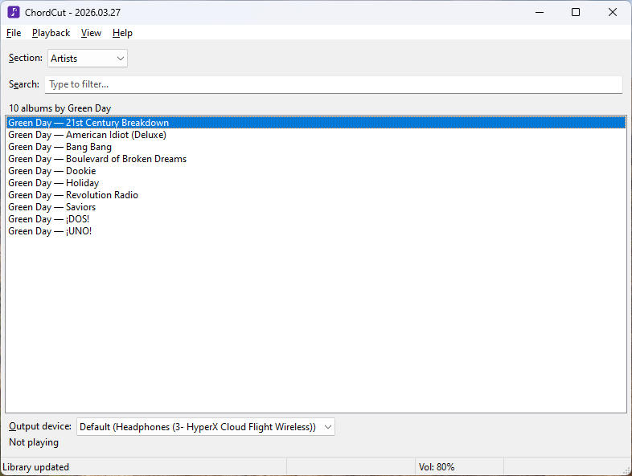
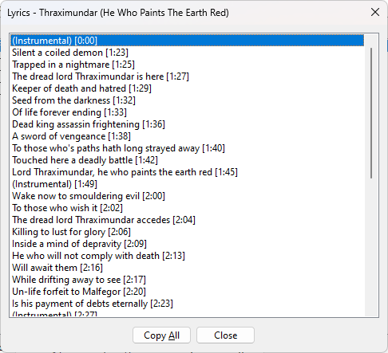

[Download latest version (ChordCut-Windows.zip)](https://github.com/Futyn-Maker/chordcut/releases/latest/download/ChordCut-Windows.zip)

# ChordCut

ChordCut is a portable music client for [Jellyfin](https://jellyfin.org/) media servers on Windows. It plays every audio format natively through MPV with no server-side transcoding, presents your library in a fast multi-column view with cover art, and includes synced lyrics, playlists, and a playback bar with full transport controls. Every feature can be reached with the mouse or the keyboard, and screen readers such as NVDA and JAWS are supported out of the box.

## Screenshots









## Features

- Stream music directly from your Jellyfin server with no transcoding — all audio formats are played natively through MPV.
- Multi-column library view with cover art thumbnails, hover highlighting, and a marker on the track that is currently playing. Artwork is cached locally, so it loads once and works offline afterwards.
- Browse by tracks, artists, album artists, albums, and playlists with hierarchical drill-down navigation.
- Playback bar with seek bar, transport buttons, shuffle and repeat toggles, and a volume slider.
- Lyrics panel beside the library: synced lyrics scroll karaoke-style with the music; click a line to jump to it.
- Plain and synced (timed) lyrics dialogs; in synced lyrics the current line is highlighted as the track plays.
- Real-time search that filters the current section as you type.
- Sort tracks alphabetically or by date added; filter by music library if your server has more than one.
- Playback queue with next/previous track, repeat, and shuffle.
- Create, rename, and delete playlists; add or remove tracks; reorder tracks by drag and drop, keyboard, or the context menu.
- Select multiple tracks to build a custom playback queue, bulk-add to playlists, bulk-download, and more.
- Download individual tracks or multiple selected tracks at once to a configurable folder.
- View detailed properties for tracks (including bitrate, format, and file size), albums, artists, and playlists.
- Copy a Jellyfin web link for any item or a direct stream link for tracks.
- Sleep timer with three actions: close the program, shut down, or put the computer to sleep.
- System tray icon with basic playback controls — minimize and keep listening in the background.
- Global hotkeys that work from any application — play/pause, previous/next track, seeking, volume, repeat, shuffle, and showing or hiding the window.
- Hardware media keys and Bluetooth headset buttons are supported through the standard Windows media session, with the playing track's title, artist, and cover art shown in the system media flyout.
- Connect to multiple Jellyfin servers and switch between them.
- Full keyboard operability and screen reader support (NVDA, JAWS); the interface follows the Windows theme, including high-contrast modes.
- Configurable volume and seek steps, output device selection; window size and position, volume, and device are remembered across restarts.
- Built-in auto-update — check for new versions on startup or on demand, download and install without leaving the app.
- Fully portable — the entire program runs from a single folder with no installation required.

## Getting Started

### Connecting to a Server

On first launch, ChordCut shows a login dialog. Enter your Jellyfin server URL (e.g. `https://demo.jellyfin.org/unstable`), username, and password, then press Connect. On subsequent launches, the saved credentials are used automatically.

### Interface Overview

The main window consists of:

- **Section selector** — switches between Tracks, Playlists, Artists, Album Artists, and Albums.
- **Search field** — filters the current list as you type.
- **Library view** — the items of the current section, shown as a table with columns for cover art, title, artist, album, track number, and length (the set of columns depends on the section; on narrow windows less important columns are hidden). A label above the view shows a contextual count (e.g. "1100 tracks", "5 albums by Artist Name"), and the track that is currently playing is marked in the list.
- **Lyrics panel** (optional) — shows the lyrics of the playing track beside the library; hidden by default.
- **Output device selector** — chooses the audio output device.
- **Playback bar** — album art and the now-playing line, a seek bar with elapsed and total time, buttons for shuffle, previous, play/pause, next, and repeat, buttons for the lyrics panel and settings, and a volume slider. Hovering any control shows a tooltip with its keyboard shortcut. Active toggles (shuffle, repeat, lyrics panel) are drawn in the accent color with a dot beneath.

The status bar at the bottom shows the current status, playback time, sleep timer countdown (if active), and volume level. The Tab key moves keyboard focus between the section selector, search field, library view, and device selector.

## Usage Guide

### Browsing the Library

Switch sections with the section selector. To open an item — an artist's albums, an album's tracks — double-click it or press Enter. To go back one level, press Backspace, press the Back button on your mouse (if it has one), or choose Go Back from the context menu.

### Playing Music

Double-click a track, press Enter, or press the play/pause media key (when nothing is playing) to start playback; this also creates a queue from all currently visible tracks. Skip between tracks with the previous/next buttons on the playback bar, Shift+Left / Shift+Right, or the previous/next media keys on your keyboard. Pause and resume with the play/pause button, Escape, or the play/pause media key.

Toggle repeat with the repeat button, Playback > Repeat, or Ctrl+Alt+R (loops the current track; next/previous still works). Toggle shuffle with the shuffle button, Playback > Shuffle, or Ctrl+Alt+S (reorders the queue; disabling it restores the original order). Stop playback entirely with Playback > Stop, Ctrl+Alt+Q, or the stop media key — this also destroys the queue.

### Volume and Seeking

Drag or click the seek bar to jump anywhere in the track, and drag the volume slider to set the volume. The mouse wheel also works over the playback bar: over the seek bar it seeks, elsewhere it changes the volume.

From the keyboard, Ctrl+Up / Ctrl+Down adjusts volume and Ctrl+Right / Ctrl+Left seeks forward or backward. The step size for keys and wheel is configurable in Settings (F8); defaults are 5% for volume and 5 seconds for seeking.

### Searching and Sorting

Type in the search field to filter the current section. The search matches by name for artists and playlists, by name and artist for albums, and by name, artist, and album artist for tracks.

Change the sort order of the Tracks section via View > Sorting: alphabetical A–Z or Z–A, or by date added newest or oldest first. Other sections have fixed sort orders (albums by track number, playlists by position, artists alphabetically).

### Library Filtering

If your server has multiple music libraries (e.g. "Music" and "Soundtracks"), use View > Libraries to check or uncheck which ones are visible. The selection is saved across restarts. Playlists are always shown regardless of library selection.

### Playlist Management

- **Create**: File > New Playlist or Ctrl+N. Enter a name in the dialog.
- **Rename**: select a playlist and press F2, or use the context menu.
- **Delete**: select a playlist and press Delete, or use the context menu. Confirm in the dialog.
- **Add a track**: open the context menu on any track, choose Add to Playlist, and pick a playlist from the submenu. The track is added to the top.
- **Remove a track**: inside a playlist, select a track and press Delete, or use the context menu.
- **Reorder tracks**: inside a playlist, drag a track to its new position with the mouse, press Alt+Up / Alt+Down to move it one step, Alt+Home / Alt+End to move it to the top or bottom, or use the context menu. (Dragging is available while the list is unfiltered and not shuffled, so that list positions match playlist positions.)

### Multi-Track Selection

You can select multiple tracks from any track list to build a custom playback queue or perform bulk actions.

- **Add a track to the selection**: press Space on a track, or Ctrl+click it. Ctrl+Shift+click adds a whole range of tracks. Selected tracks get a checkmark in the list, and the selection keeps the order in which you added tracks. Ctrl+clicking an already-selected track removes it from the selection.
- **Selected tracks area**: once at least one track is selected, a new area appears between the main list and the output device selector. It shows the number of selected tracks and contains its own list. A "Clear selection" button removes all selected tracks.
- **Remove a track from the selection**: press Space (or Ctrl+click) on a track inside the selected tracks list. If the last track is removed, the area disappears.
- **Play from selection**: double-click a track in the selected tracks list, or press Enter on it, to start playback using the selection as the queue.
- **Reorder**: inside the selected tracks list, drag a track to its new position with the mouse, press Alt+Up / Alt+Down to move it one step, Alt+Home / Alt+End to move it to the top or bottom, or use the context menu to change the playback order.
- **Bulk actions**: when the focus is inside the selected tracks list, hotkeys and the context menu apply to all selected tracks:
  - Ctrl+Shift+Enter — download all selected tracks one by one.
  - Ctrl+C — copy Jellyfin web links for all selected tracks (one per line).
  - Ctrl+Shift+C — copy stream links for all selected tracks (one per line).
  - Context menu > Add All to Playlist — add all selected tracks to a chosen playlist, skipping those already present.
  - Context menu > Remove All from Playlist — available only when viewing a specific playlist; removes selected tracks that belong to that playlist.
  - Delete key — same as Remove All from Playlist when available.
- **Persistence**: the selection is preserved when navigating between sections and lists. It is cleared only when you press "Clear selection" or close the application.

**Note:** when the focus is on the main track list, all actions (Enter, context menu, hotkeys) still apply to the single focused track, regardless of whether a selection exists.

### Lyrics

The **lyrics panel** shows the lyrics of the playing track beside the library. Toggle it with View > Lyrics Panel, the F9 key, or the lyrics button on the playback bar; the choice is remembered. Synced lyrics follow the music karaoke-style — the current line is emphasized and kept centered — and clicking a line jumps playback to it. Scrolling with the mouse wheel pauses the automatic following for a few seconds. Plain lyrics are shown as scrollable text.

Lyrics also open in dialogs: press **Ctrl+Alt+Enter** on a track for plain lyrics, or **Alt+Shift+Enter** for synced (timed) lyrics — both are in the context menu as well. In the synced lyrics dialog the line being sung is highlighted as the track plays; press Enter or double-click any line to seek to its timestamp, and use Ctrl+J or the "Jump to current" button to move to the line at the current playback position. Ctrl+Up/Down adjusts volume and Ctrl+Right/Left seeks within the dialog, as in the main window. Press Backspace to close the dialog, or Escape to pause/resume playback. Use Ctrl+C to copy the selected line, or the Copy All button to copy all lyrics.

### Downloading Tracks

Select a track and press Ctrl+Shift+Enter, or use the context menu. A progress dialog appears. The download folder is configurable in Settings (F8); by default it is the `music` subfolder next to the executable.

### Properties and Links

Press Alt+Enter on any item (or choose Properties from the context menu) to view its properties. For tracks, this includes bitrate, audio format, and file size. Press Ctrl+C in the properties dialog to copy a value.

In the main list, press Ctrl+C to copy the Jellyfin web link for the selected item, or Ctrl+Shift+C to copy the direct audio stream link.

### Context Menu

Right-click an item — or press the Applications key or Shift+F10 — to open the context menu. Right-clicking acts on the item under the mouse pointer; the keyboard invocations act on the focused item. The available actions depend on the item type: play, open, go to artist/album, add to playlist, lyrics, download, copy link, properties, and more. Inside a playlist, additional options for removing and reordering tracks appear.

### Sleep Timer

Open via File > Sleep Timer. Set hours, minutes, and seconds, choose an action (close the program, shut down, or sleep), and press Enable Timer. The countdown appears in the status bar. Choose the menu item again to cancel the timer.

### Background Listening

ChordCut is built to keep playing while you work in other applications. Two mechanisms make this convenient:

**Global hotkeys.** A set of system-wide shortcuts on the Ctrl+Shift+Alt layer works no matter which application is focused — even while ChordCut is hidden in the tray. The full list is in the [Keyboard Shortcuts](#keyboard-shortcuts) table below; left and right modifier keys both work. The combinations were chosen to avoid conflicts: screen reader commands (NVDA and JAWS table navigation lives on Ctrl+Alt), AltGr-based typing layouts, and common application shortcuts all stay untouched. If another program already owns one of the combinations, ChordCut simply skips it and lists it as unavailable in the built-in shortcuts help (F1) — it never takes a hotkey away from a running program. Global hotkeys can be turned off entirely in Settings.

**Media keys.** The keyboard's hardware media keys (play/pause, next, previous, stop) and Bluetooth headset buttons control ChordCut through the standard Windows media session. Windows itself decides which running player receives them — normally the one that played most recently — so ChordCut never competes with other applications for these keys. The system media flyout displays the playing track's title, artist, album, and cover art; its buttons, seek bar, and shuffle and repeat toggles control ChordCut directly.

### System Tray

To hide ChordCut to the notification area and keep the music playing, choose File > Minimize to Tray, press Ctrl+Shift+Alt+C, or click the tray icon. By default the close button and Alt+F4 also hide the window to the tray instead of exiting (this can be turned off in Settings); use File > Exit or the tray menu's Exit to quit. Click the tray icon, press Ctrl+Shift+Alt+C again (it works globally as a show/hide toggle), or choose Restore from the icon's context menu to bring the window back. The tray icon's tooltip names the playing track, and its context menu provides basic playback controls: pause/resume, next/previous track, volume, seeking, repeat, and shuffle.

### Multiple Servers

Add servers via File > Change Server > Manage Servers. In the dialog, use Add to connect to a new server, Edit to update credentials, or Delete to remove a server (the last server cannot be deleted); the currently active server is marked in the list. Switch between servers from the File > Change Server submenu.

### Settings

Press F8, go to File > Settings, or click the gear button on the playback bar to configure:

- **Download folder** — where downloaded tracks are saved.
- **Volume step** — how much the volume changes per keypress or wheel notch (1–20%, default 5).
- **Seek step** — how far to seek per keypress or wheel notch (1–60 seconds, default 5).
- **Remember volume level on exit** — restore the last volume on next launch.
- **Remember output device on exit** — restore the last output device on next launch.
- **Close button minimizes to tray** — when checked (default), the close button and Alt+F4 hide the window to the notification area instead of exiting. Use File > Exit or the tray menu to quit.
- **Global hotkeys** — when checked (default), the system-wide shortcuts are active from any application. See [Background Listening](#background-listening).
- **Check for updates on startup** — when checked (default), ChordCut silently checks for a newer version when launched. If an update is found, a dialog offers to download and install it. You can also check manually at any time via Help > Check for Updates.

## Keyboard Shortcuts

| Key                         | Action                                                            |
| --------------------------- | ----------------------------------------------------------------- |
| Tab                         | Cycle between section selector, search, list, and device selector |
| Enter                       | Play track / drill into item                                      |
| Backspace                   | Go back one level                                                 |
| Escape                      | Pause / Resume                                                    |
| Ctrl+Shift+Alt+C            | Minimize to system tray                                           |
| Ctrl+Alt+Q                  | Stop playback and destroy queue                                   |
| Shift+Right                 | Next track                                                        |
| Shift+Left                  | Previous track                                                    |
| Ctrl+Alt+X                  | Restart current track                                             |
| Ctrl+Alt+R                  | Toggle repeat                                                     |
| Ctrl+Alt+S                  | Toggle shuffle                                                    |
| Ctrl+Up                     | Volume up                                                         |
| Ctrl+Down                   | Volume down                                                       |
| Ctrl+Right                  | Seek forward                                                      |
| Ctrl+Left                   | Seek backward                                                     |
| F9                          | Show or hide the lyrics panel                                     |
| Ctrl+N                      | Create new playlist                                               |
| F2                          | Rename playlist                                                   |
| Delete                      | Delete playlist / Remove track from playlist                      |
| Alt+Up                      | Move track up in playlist                                         |
| Alt+Down                    | Move track down in playlist                                       |
| Alt+Home                    | Move track to the top of the playlist                             |
| Alt+End                     | Move track to the bottom of the playlist                          |
| Space                       | Add track to selection (track lists only)                         |
| Space (in selection)        | Remove track from selection                                       |
| Enter (in selection)        | Play from selection queue                                         |
| Alt+Up/Down (in selection)  | Reorder tracks in selection                                       |
| Alt+Home/End (in selection) | Move track to the top / bottom of the selection                   |
| Delete (in selection)       | Remove selected tracks from playlist                              |
| Alt+Enter                   | Properties                                                        |
| Ctrl+Alt+Enter              | View lyrics (tracks only)                                         |
| Alt+Shift+Enter             | View synced lyrics (tracks only)                                  |
| Ctrl+J (synced lyrics)      | Jump to the line at the playback position                         |
| Ctrl+C                      | Copy Jellyfin link                                                |
| Ctrl+Shift+C                | Copy stream link (tracks only)                                    |
| Ctrl+Shift+Enter            | Download track                                                    |
| F5                          | Refresh library                                                   |
| F8                          | Settings                                                          |
| F1                          | Keyboard shortcuts reference                                      |
| Alt+F4                      | Minimize to tray (default) / Exit                                 |

### Global Hotkeys

These work from any application, even while ChordCut is minimized or hidden in the tray:

| Key                  | Action                 |
| -------------------- | ---------------------- |
| Ctrl+Shift+Alt+Space | Play / Pause           |
| Ctrl+Shift+Alt+P     | Previous track         |
| Ctrl+Shift+Alt+N     | Next track             |
| Ctrl+Shift+Alt+Left  | Seek backward          |
| Ctrl+Shift+Alt+Right | Seek forward           |
| Ctrl+Shift+Alt+Up    | Volume up              |
| Ctrl+Shift+Alt+Down  | Volume down            |
| Ctrl+Shift+Alt+R     | Toggle repeat          |
| Ctrl+Shift+Alt+S     | Toggle shuffle         |
| Ctrl+Shift+Alt+C     | Show / hide the window |

Hardware media keys (play/pause, next, previous, stop) and Bluetooth headset buttons also work system-wide.

## Building from Source

ChordCut must be built on Windows (PyInstaller cannot cross-compile).

### Prerequisites

- Python 3.12 or later. Make sure "Add Python to PATH" is checked during installation.
- Git (to clone the repository).

### Steps

1. Clone the repository:

   ```
   git clone https://github.com/Futyn-Maker/chordcut.git
   cd chordcut
   ```

2. Run the build script:
   ```
   build\build.bat
   ```

The script will install all dependencies, download libmpv if it is not already present (or you can place `mpv-2.dll` / `libmpv-2.dll` into `resources\libmpv\` manually beforehand), compile translations, and build the application.

The output is a portable folder at `dist\ChordCut\`. Run `dist\ChordCut\ChordCut.exe` to launch.

## Translation

ChordCut uses gettext for internationalization. The application detects the system locale automatically and loads the matching translation if available.

### Translating into a new language

1. Download the `chordcut.pot` template from the [latest GitHub release](https://github.com/Futyn-Maker/chordcut/releases/latest), or generate it from source (requires `pip install babel`):

   ```
   pybabel extract --add-comments=Translators --charset=UTF-8 --project=ChordCut -o locale/chordcut.pot src/chordcut/
   ```

2. Create a new `.po` file for your language (replace `xx` with the language code, e.g. `de`, `fr`, `es`):

   ```
   pybabel init -i locale/chordcut.pot -d locale -D chordcut -l xx
   ```

3. Open the `.po` file in any text editor or a tool like [Poedit](https://poedit.net/) and translate the strings.

4. Compile the translation:

   ```
   pybabel compile -d locale -D chordcut
   ```

5. Place the compiled `chordcut.mo` file into `locale/xx/LC_MESSAGES/` next to the ChordCut executable.

To update an existing translation after the template changes:

```
pybabel update -i locale/chordcut.pot -d locale -D chordcut
```

Then re-translate any new or changed strings and recompile.

### Translating the documentation

Each release ships this documentation as `readme_<lang>.html`, generated from `README_<lang>.md` (`README.md` for English). To translate it, add a `README_xx.md` next to the existing ones, keeping the first two lines in the same shape: the download link, then the top-level heading. The few labels the page adds around the text — the window title suffix, the "Contents" heading, the skip link, and the "Copy" button on code blocks — live in the `strings` table at the top of `build/docs.lua`; add an entry for your language code there. Languages without an entry get the English labels.

## Credits

- ChordCut was inspired by [VKBoss+](https://vkboss.ru), an accessible VK music client. Many interface decisions and the overall UX approach were borrowed from that project. Thank you guys for the best music client for VK, which I still use to this day! :)
