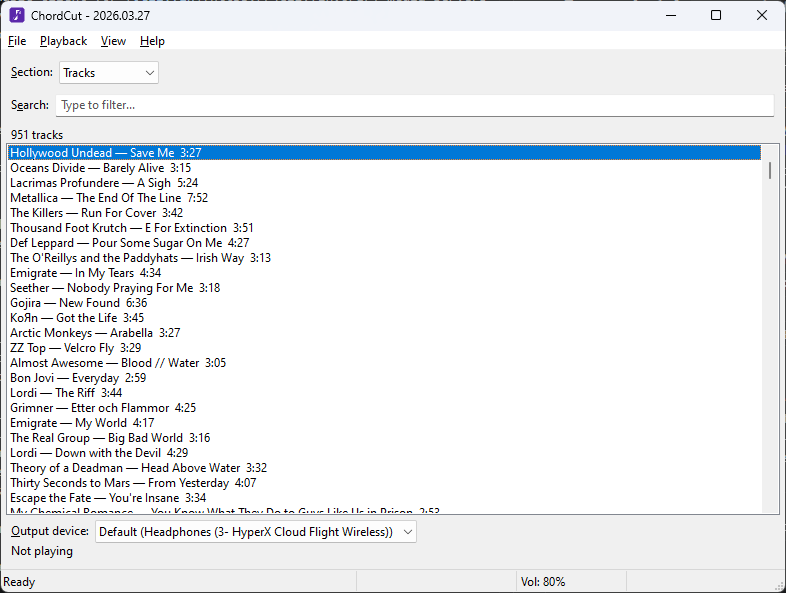
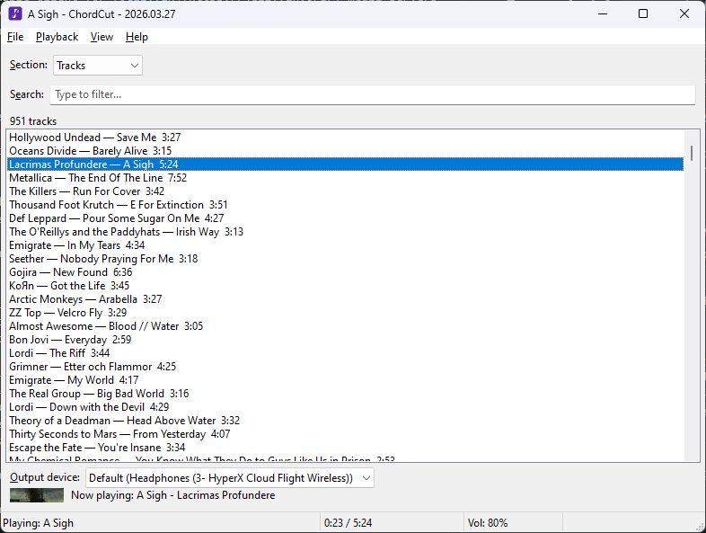
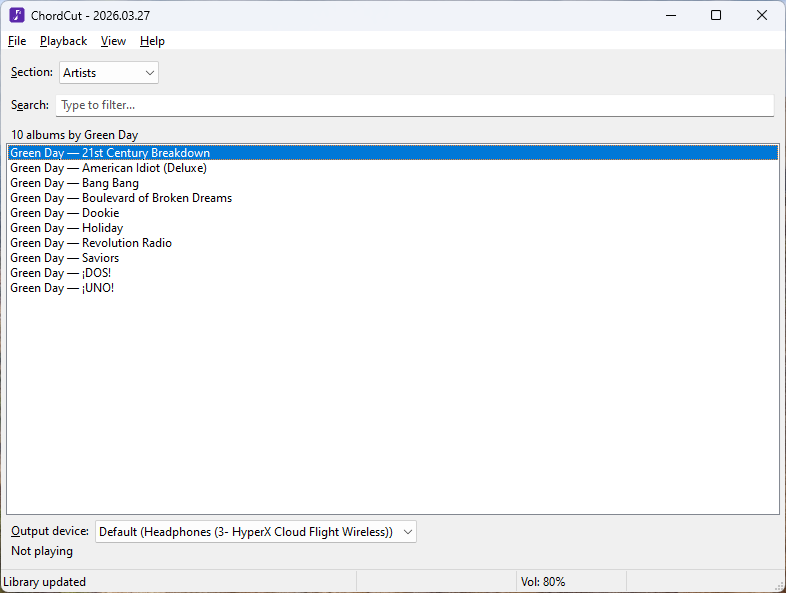
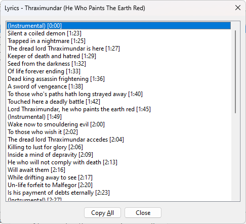

[Скачать последнюю версию (ChordCut-Windows.zip)](https://github.com/Futyn-Maker/chordcut/releases/latest/download/ChordCut-Windows.zip)

# ChordCut

ChordCut — это портативный музыкальный клиент для [Jellyfin](https://jellyfin.org/) на Windows. Программа разработана прежде всего для незрячих и слабовидящих пользователей: она полностью совместима с NVDA, JAWS и другими программами экранного доступа, а всё управление осуществляется с клавиатуры.

## Скриншоты

## Возможности

- Воспроизведение музыки прямо с сервера Jellyfin без перекодирования — все форматы аудио воспроизводятся нативно через MPV.
- Просмотр медиатеки по разделам: композиции, исполнители, исполнители альбома, альбомы, плей-листы — с иерархической навигацией.
- Поиск в реальном времени: список фильтруется по мере ввода.
- Сортировка композиций по алфавиту или дате добавления.
- Фильтрация по медиатекам, если на сервере их несколько.
- Очередь воспроизведения со следующей/предыдущей композицией, повтором и перемешиванием.
- Создание, переименование, удаление плей-листов и изменение порядка композиций в них. Добавление и удаление композиций.
- Выбор нескольких композиций для формирования очереди, массового добавления в плей-лист, массового скачивания и других действий.
- Просмотр обычного и синхронизированного текста песни. Переход к любой строке в синхронизированном тексте для прыжка к нужному моменту.
- Скачивание отдельных композиций или нескольких выбранных сразу в настраиваемую папку.
- Просмотр подробных свойств композиций (битрейт, формат, размер файла), альбомов, исполнителей и плей-листов.
- Копирование ссылки Jellyfin на любой элемент или прямой ссылки потока для композиций.
- Таймер сна с тремя действиями: закрыть программу, выключить компьютер или перевести в спящий режим.
- Значок в системном трее с базовым управлением воспроизведением — сворачивайте программу и слушайте музыку в фоне.
- Подключение к нескольким серверам Jellyfin и переключение между ними.
- Настройка шага громкости и перемотки, выбор устройства вывода, сохранение параметров между запусками.
- Встроенное автообновление — проверка новых версий при запуске или по запросу с установкой без выхода из программы.
- Полностью портативная: программа запускается из одной папки без установки.

## Начало работы

### Установка

Скачайте архив `ChordCut-Windows.zip` со [страницы последнего релиза](https://github.com/Futyn-Maker/chordcut/releases/latest/download/ChordCut-Windows.zip) и распакуйте его в любую удобную папку. Никакой установки не требуется — просто запустите `ChordCut.exe`.

### Подключение к серверу

При первом запуске ChordCut открывает диалог подключения. Введите адрес сервера Jellyfin (например, `https://demo.jellyfin.org/unstable`), имя пользователя и пароль, затем нажмите «Подключиться». При следующих запусках сохранённые данные используются автоматически.

### Обзор интерфейса

Главное окно содержит четыре элемента, между которыми можно переключаться клавишей Tab:

1. **Раздел** — выбор раздела медиатеки: Композиции, Плей-листы, Исполнители, Исполнители альбома, Альбомы.
2. **Поиск** — поле ввода для фильтрации текущего списка в реальном времени.
3. **Медиатека** — список элементов текущего раздела. Метка над списком показывает контекстный счётчик (например, «1100 композиций», «5 альбомов Исполнитель»).
4. **Устройство вывода** — выбор аудиоустройства для воспроизведения.

Строка состояния внизу окна показывает текущую композицию, время воспроизведения, обратный отсчёт таймера сна (если активен) и уровень громкости.

Строка меню содержит четыре меню: **Файл**, **Воспроизведение**, **Вид**, **Справка**.

## Использование

### Навигация по медиатеке

Переключайтесь между разделами стрелками в поле «Раздел». Нажмите Enter на исполнителе, чтобы увидеть его альбомы; нажмите Enter на альбоме, чтобы открыть его композиции, и так далее. Нажмите Backspace, чтобы вернуться на уровень назад.

Поиск работает по названию для исполнителей и плей-листов, по названию и исполнителю для альбомов, по названию, исполнителю и исполнителю альбома для композиций.

### Воспроизведение

Нажмите Enter на композиции, чтобы начать воспроизведение. При этом автоматически формируется очередь из всех видимых в данный момент композиций. Для перехода к следующей или предыдущей используйте Shift+стрелка вправо и Shift+стрелка влево. Клавиша Escape ставит воспроизведение на паузу или возобновляет его.

- **Повтор** (Ctrl+Alt+R) — зацикливает текущую композицию. Переход к следующей/предыдущей при этом продолжает работать.
- **Перемешать** (Ctrl+Alt+S) — изменяет порядок очереди случайным образом. При отключении исходный порядок восстанавливается.
- **Остановить** (Ctrl+Alt+Q) — полностью останавливает воспроизведение и удаляет очередь.
- **Начать сначала** (Ctrl+Alt+X) — воспроизводит текущую композицию с начала.

### Громкость и перемотка

Ctrl+стрелка вверх / Ctrl+стрелка вниз изменяют громкость. Ctrl+стрелка вправо / Ctrl+стрелка влево выполняют перемотку вперёд или назад. Размер шага для обоих действий настраивается в диалоге «Настройки» (F8); по умолчанию — 5% для громкости и 5 секунд для перемотки.

### Поиск и сортировка

Введите текст в поле поиска, чтобы фильтровать текущий список в реальном времени. Очистите поле, чтобы снова увидеть весь список.

Порядок сортировки раздела «Композиции» задаётся в меню **Вид > Сортировка**:

- По алфавиту А–Я
- По алфавиту Я–А
- По дате добавления (сначала новые)
- По дате добавления (сначала старые)

Для остальных разделов порядок фиксирован: альбомы сортируются по номеру дорожки, плей-листы — по позиции, исполнители — по алфавиту.

Пункт **Вид > Перемешать список** случайным образом перетасовывает текущий список — это удобно, если нужно быстро сформировать случайную очередь.

### Фильтрация по медиатекам

Если на сервере несколько музыкальных медиатек (например, «Музыка» и «Саундтреки»), используйте меню **Вид > Медиатеки**, чтобы включить или отключить нужные. Выбор сохраняется между запусками. Плей-листы отображаются всегда, независимо от фильтра.

### Управление плей-листами

- **Создать**: Ctrl+N или **Файл > Новый плей-лист...**. Введите название в появившемся диалоге.
- **Переименовать**: выберите плей-лист и нажмите F2 или откройте контекстное меню.
- **Удалить**: выберите плей-лист и нажмите Delete или откройте контекстное меню. Подтвердите удаление в диалоге.
- **Добавить композицию**: откройте контекстное меню на любой композиции, выберите «Добавить в плей-лист» и выберите нужный плей-лист в подменю. Композиция добавляется в начало.
- **Удалить из плей-листа**: находясь внутри плей-листа, выберите композицию и нажмите Delete или откройте контекстное меню.
- **Изменить порядок**: внутри плей-листа используйте Alt+стрелка вверх и Alt+стрелка вниз для перемещения выбранной композиции на одну позицию вверх или вниз или воспользуйтесь контекстным меню.

### Выбор нескольких композиций

Из любого списка композиций можно выбрать несколько, чтобы сформировать собственную очередь воспроизведения или выполнить массовые действия.

- **Добавить в выбранные**: нажмите пробел на любой композиции в списке. Композиции добавляются в порядке выбора. Повторное нажатие пробела на уже выбранной композиции не даёт эффекта.
- **Область выбранных**: после выбора хотя бы одной композиции нажатием Tab можно перейти в новую область. В ней отображаются выбранные композиции. Кнопка «Очистить выбор» очищает выбор.
- **Убрать из выбранных**: нажмите пробел на композиции внутри списка выбранных. Когда убирается последняя, область исчезает и фокус возвращается в основной список.
- **Воспроизвести выбранное**: нажмите Enter на любой композиции в списке выбранных — воспроизведение начнётся с этой композиции, а вся подборка станет очередью.
- **Изменить порядок**: используйте Alt+стрелка вверх / Alt+стрелка вниз внутри списка выбранных.
- **Групповые действия** (когда фокус в списке выбранных):
  - Ctrl+Shift+Enter — скачать все выбранные композиции по одной.
  - Ctrl+C — скопировать ссылки Jellyfin на все выбранные композиции (по одной на строку).
  - Ctrl+Shift+C — скопировать прямые ссылки потоков на все выбранные композиции (по одной на строку).
  - Контекстное меню > «Добавить всё в плей-лист» — добавить все выбранные композиции в указанный плей-лист, пропуская уже присутствующие.
  - Контекстное меню > «Удалить всё из плей-листа» — удалить выбранные композиции из текущего плей-листа (доступно только внутри плей-листа).
  - Delete — то же, что «Удалить всё из плей-листа», если это действие доступно.
- **Сохранение**: выбор сохраняется при навигации между разделами. Он сбрасывается только при нажатии «Очистить выбор» или закрытии программы.

> **Примечание.** Когда фокус находится в основном списке, все действия (Enter, контекстное меню, горячие клавиши) применяются к той единственной композиции, на которой стоит курсор — независимо от того, есть ли выбранные.

### Текст песни

Нажмите **Ctrl+Alt+Enter** на композиции, чтобы просмотреть обычный текст, или **Alt+Shift+Enter** — чтобы открыть синхронизированный текст. Те же действия доступны через контекстное меню: «Показать текст» и «Синхронизированный текст».

В диалоге синхронизированного текста нажмите Enter на любой строке, чтобы осуществить прыжок к соответствующему моменту в композиции. Ctrl+стрелка вверх/вниз и Ctrl+стрелка вправо/влево изменяют громкость и выполняют перемотку так же, как в главном окне. Backspace закрывает диалог, Escape ставит воспроизведение на паузу или возобновляет его. Ctrl+C копирует выделенную строку, кнопка «Копировать всё» — весь текст.

### Скачивание

Нажмите Ctrl+Shift+Enter на композиции или выберите «Скачать» в контекстном меню. Откроется диалог с прогрессом загрузки. Папка для сохранения настраивается в разделе «Настройки» (F8); по умолчанию это вложенная папка `music` рядом с исполняемым файлом.

### Свойства и ссылки

Нажмите Alt+Enter на любом элементе, чтобы открыть его свойства. Для композиций здесь отображаются: название, исполнитель, исполнитель альбома, альбом, продолжительность, номер композиции, формат, битрейт, размер файла и дата добавления. Нажмите Ctrl+C в диалоге свойств, чтобы скопировать выбранное значение.

В основном списке нажмите Ctrl+C, чтобы скопировать ссылку Jellyfin на выбранный элемент, или Ctrl+Shift+C, чтобы скопировать прямую ссылку потока (только для композиций).

### Контекстное меню

Нажмите клавишу Applications, Shift+F10 или правую кнопку мыши, чтобы открыть контекстное меню. Доступные действия зависят от типа элемента: воспроизвести, открыть, перейти к исполнителю/альбому, добавить в плей-лист, показать текст, скачать, копировать ссылку, свойства и другие. Внутри плей-листа появляются дополнительные пункты для удаления и изменения порядка.

### Таймер сна

Откройте **Файл > Таймер сна...**. Задайте часы, минуты и секунды, выберите действие («Закрыть программу», «Выключить компьютер» или «Перевести компьютер в спящий режим») и нажмите «Включить таймер». Обратный отсчёт отображается в строке состояния. Чтобы отменить таймер, нажмите на этот же пункт меню повторно.

### Системный трей

Нажмите Shift+Escape, чтобы свернуть ChordCut в область уведомлений, или включите параметр «Кнопка закрытия сворачивает в трей вместо выхода» в настройках — тогда кнопка закрытия и Alt+F4 тоже будут сворачивать, а не завершать работу. Для выхода из программы в таком режиме используйте **Файл > Выход** или меню значка в трее.

Двойной щелчок по значку трея или пункт «Восстановить» в его контекстном меню возвращают главное окно. Контекстное меню трея также предоставляет базовое управление воспроизведением: пауза/продолжить, следующая/предыдущая, громче/тише, перемотка вперёд/назад, повтор, перемешать и закрыть.

### Использование нескольких серверов

Добавляйте серверы через **Файл > Сменить сервер > Управление серверами...**. В диалоге используйте «Добавить...» для нового сервера, «Изменить...» для обновления данных и «Удалить» для удаления (единственный сервер удалить нельзя). Переключение между серверами — через подменю **Файл > Сменить сервер**.

### Настройки

Нажмите F8 или откройте **Файл > Настройки...**. Доступные параметры:

- **Папка для загрузок** — папка, в которую сохраняются скачанные композиции.
- **Шаг громкости (%)** — на сколько процентов меняется громкость за одно нажатие (от 1 до 20, по умолчанию 5).
- **Шаг перемотки (в секундах)** — на сколько секунд выполняется перемотка за одно нажатие (от 1 до 60, по умолчанию 5).
- **Запоминать громкость при выходе** — при следующем запуске восстанавливать последний уровень громкости.
- **Запоминать устройство вывода при выходе** — при следующем запуске восстанавливать последнее выбранное аудиоустройство.
- **Кнопка закрытия сворачивает в трей вместо выхода** — если включено, кнопка закрытия и Alt+F4 сворачивают программу в трей. Для выхода используйте **Файл > Выход** или меню трея.
- **Проверять обновления при запуске** — если включено (по умолчанию), программа автоматически проверяет наличие новой версии при каждом запуске. При обнаружении обновления предлагается загрузить и установить его. Ручная проверка доступна через **Справка > Проверить обновления...**.

### Обновление программы

Если при запуске найдена новая версия, откроется диалог с описанием изменений. Нажмите «Да», чтобы начать загрузку и установку обновления — программа выполнит всё автоматически и перезапустится. Ручная проверка: **Справка > Проверить обновления...**.

## Горячие клавиши

| Клавиша | Действие |
|---------|----------|
| Tab | Переключение между элементами интерфейса |
| Enter | Воспроизвести / открыть элемент |
| Backspace | Вернуться на уровень назад |
| Escape | Пауза / Продолжить |
| Shift+Escape | Свернуть в трей |
| Ctrl+Alt+Q | Остановить воспроизведение и очистить очередь |
| Shift+стрелка вправо | Следующая композиция |
| Shift+стрелка влево | Предыдущая композиция |
| Ctrl+Alt+X | Начать сначала |
| Ctrl+Alt+R | Повтор (вкл./выкл.) |
| Ctrl+Alt+S | Перемешать (вкл./выкл.) |
| Ctrl+стрелка вверх | Громче |
| Ctrl+стрелка вниз | Тише |
| Ctrl+стрелка вправо | Перемотка вперёд |
| Ctrl+стрелка влево | Перемотка назад |
| Ctrl+N | Создать новый плей-лист |
| F2 | Переименовать плей-лист |
| Delete | Удалить плей-лист / убрать из плей-листа |
| Alt+стрелка вверх | Переместить выше в плей-листе |
| Alt+стрелка вниз | Переместить ниже в плей-листе |
| Пробел | Добавить в список выбранных (в списке композиций) |
| Пробел (в выбранных) | Убрать из выбранных |
| Enter (в выбранных) | Воспроизвести из выбранных |
| Alt+стрелка вверх/вниз (в выбранных) | Изменить порядок в выбранных |
| Delete (в выбранных) | Удалить выбранные из плей-листа |
| Alt+Enter | Свойства |
| Ctrl+Alt+Enter | Показать текст (только для композиций) |
| Alt+Shift+Enter | Синхронизированный текст (только для композиций) |
| Ctrl+C | Копировать ссылку |
| Ctrl+Shift+C | Копировать ссылку потока (только для композиций) |
| Ctrl+Shift+Enter | Скачать композицию |
| F5 | Обновить медиатеку |
| F8 | Настройки |
| F1 | Горячие клавиши |
| Alt+F4 | Свернуть в трей (если включено) / Выход |
